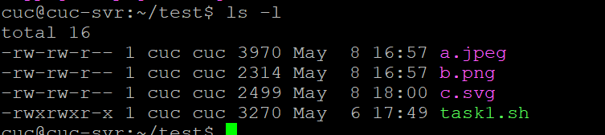
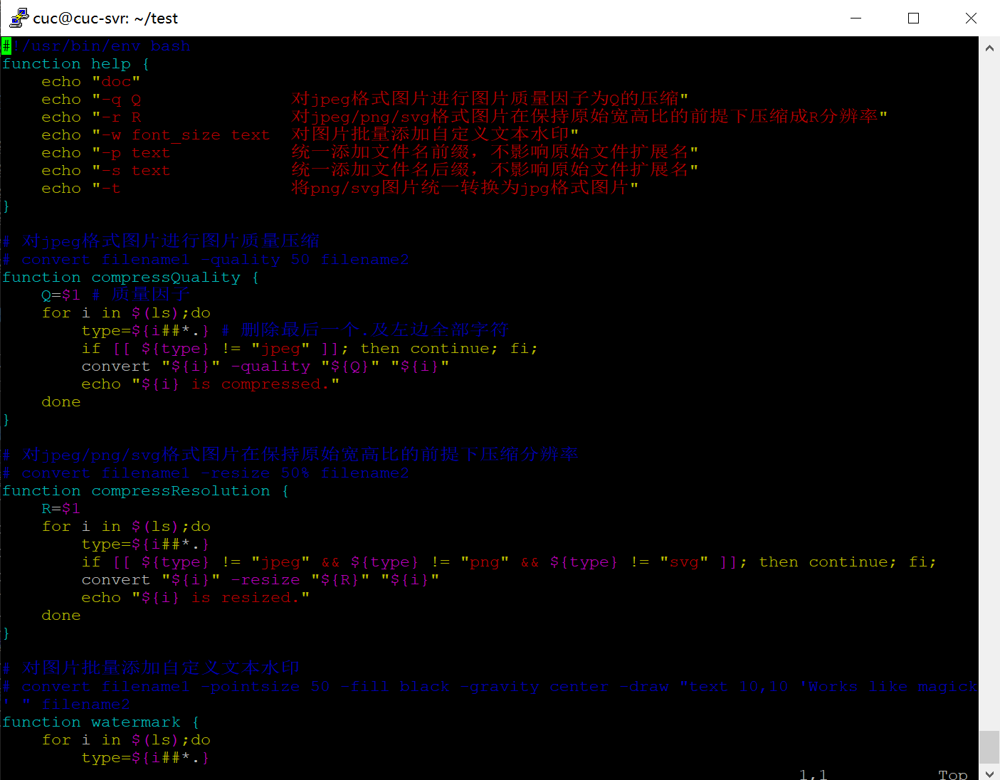
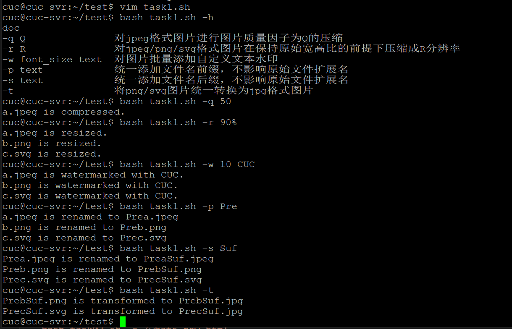
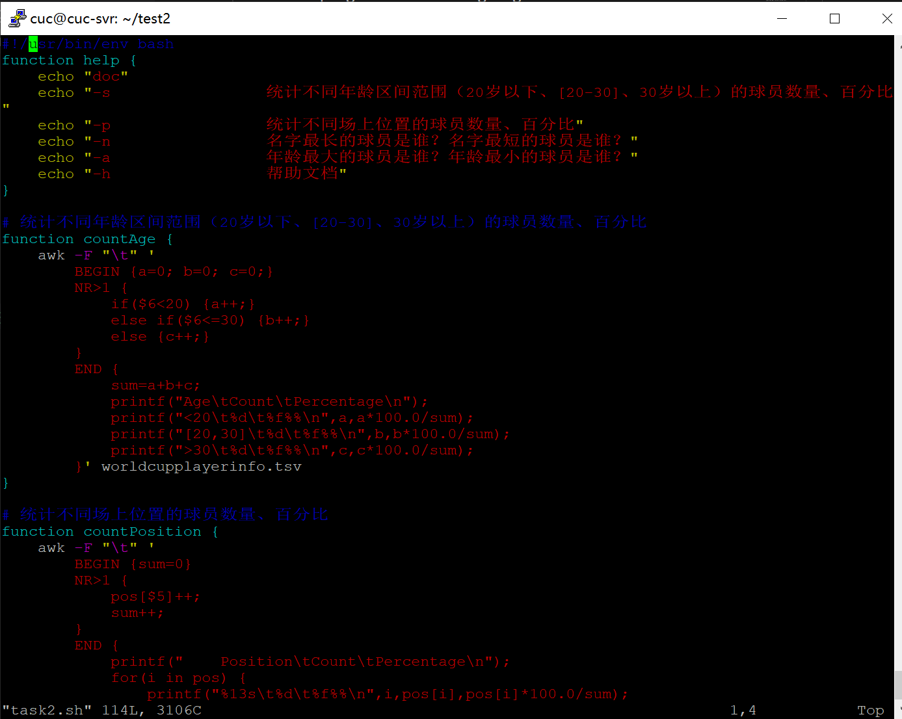
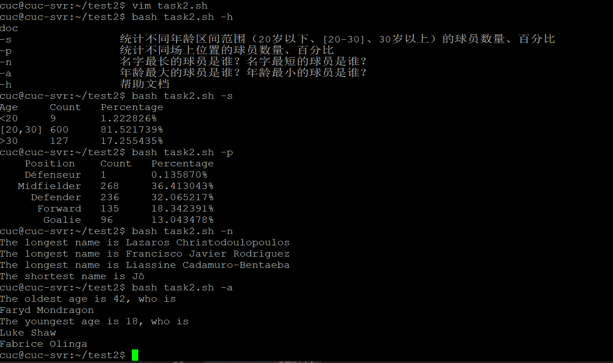
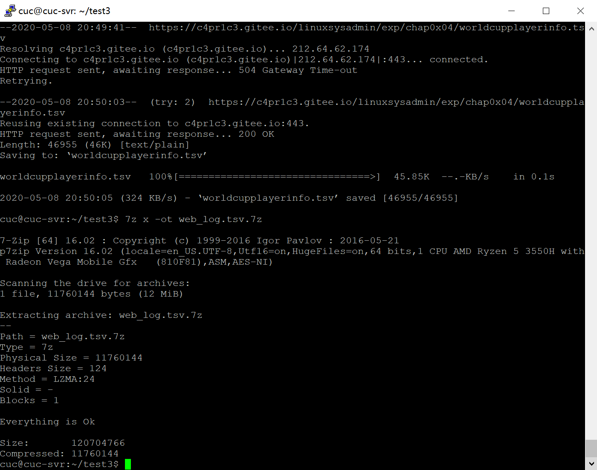
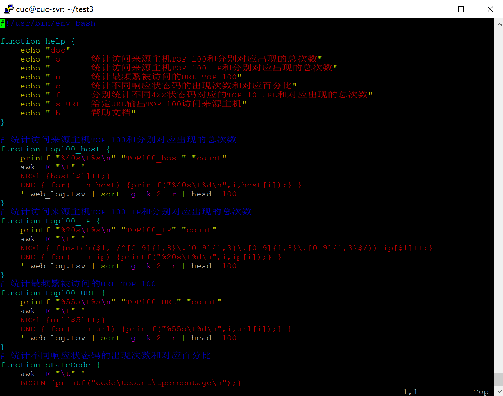
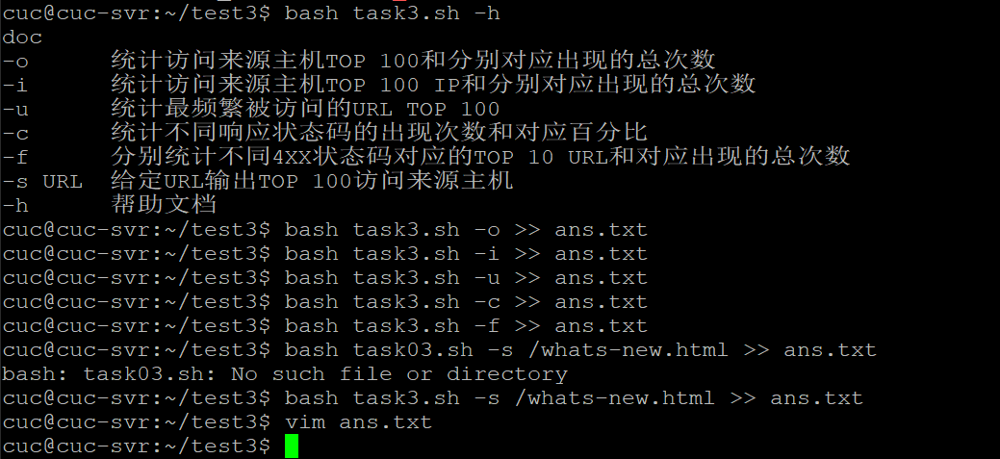

## 实验四：shell脚本编程练习基础

### 实验环境

- Ubuntu 18.04.4 Server 64bit
- PuTTY 64bit

### 编程任务

#### 任务一：用bash编写一个图片批处理脚本，实现以下功能：
- [x] 支持命令行参数方式使用不同功能
- [x] 支持对指定目录下所有支持格式的图片文件进行批处理指定目录进行批处理
- [x] 支持以下常见图片批处理功能的单独使用或组合使用
  - [x] 支持对jpeg格式图片进行图片质量压缩
  - [x] 支持对jpeg/png/svg格式图片在保持原始宽高比的前提下压缩分辨率
  - [x] 支持对图片批量添加自定义文本水印
  - [x] 支持批量重命名（统一添加文件名前缀或后缀，不影响原始文件扩展名）
  - [x] 支持将png/svg图片统一转换为jpg格式

#### 任务二：用bash编写一个文本批处理脚本，对以下附件分别进行批量处理完成相应的数据统计任务：

- [x] 统计不同年龄区间范围（20岁以下、[20-30]、30岁以上）的球员数量、百分比
- [x] 统计不同场上位置的球员数量、百分比
- [x] 名字最长的球员是谁？名字最短的球员是谁？
- [x] 年龄最大的球员是谁？年龄最小的球员是谁？

#### 任务三：用bash编写一个文本批处理脚本，对以下附件分别进行批量处理完成相应的数据统计任务：

- [x] 统计访问来源主机TOP 100和分别对应出现的总次数
- [x] 统计访问来源主机TOP 100 IP和分别对应出现的总次数
- [x] 统计最频繁被访问的URL TOP 100
- [x] 统计不同响应状态码的出现次数和对应百分比
- [x] 分别统计不同4XX状态码对应的TOP 10 URL和对应出现的总次数
- [x] 给定URL输出TOP 100访问来源主机

### 实验要求

- 所有源代码文件必须单独提交并提供详细的脚本内置帮助信息
- 任务二的所有统计数据结果要求写入独立实验报告（原文两个任务二，个人理解是指的是数据量比较大的任务三）

### 实验过程
#### 任务一
- 提前安装`imagemagick`和`shellcheck`，并用PSFTP上传需要的图片文件。
    ```bash
    sudo apt-get update
    sudo apt-get install -y shellcheck
    sudo apt-get install imagemagick
    ```
    
- 编写脚本
    
- 测试结果
    
- 传回检查
  
#### 任务二
- 将所需文件下载到本地。
    ```bash
    wget "https://c4pr1c3.gitee.io/linuxsysadmin/exp/chap0x04/worldcupplayerinfo.tsv"
     ```
- 编写脚本
    
- 测试结果
    

#### 任务三
- 提前安装 `p7zip-full`
    ```bash
    sudo apt-get install p7zip-full
    ```
- 将所需文件下载到本地并解压
    ```bash
    wget "https://c4pr1c3.gitee.io/linuxsysadmin/exp/chap0x04/worldcupplayerinfo.tsv"
    7z x web_log.tsv.7z
    ```
    
- 编写脚本
    
- 测试结果，由于结果过长，存入 `ans.txt` 文件并用PSFTP传回主机，单独编写实验报告。
    
#### Travis
- 参考老师视频，完成 `.travis.yml` 的编写。
- 安装 `shellcheck`，并根据建议更改自己的代码。
- [Travis部署结果](https://travis-ci.com/github/LyuLumos/linux-2020-LyuLumos/builds/164668476)
#### 过程中遇到的问题
- 任务二，统计位置实验结果中 `Défenseur` 应为法语守门员写法，理论上应该归入`Defender` 。源数据问题未作调整。
- 任务一加水印本地正常运行，travis运行报错 `convert:unable to read font (null)`，搜集资料后增加安装 `ghostscript`， 原因：有些系统没有默认安装字体库。
- 任务二，在 `awk` 中写 `NR>1` 的结果部分有错误，读入了题目，但是写成 `对应参数!=对应标题` 即正常运行。

### 其他说明
考虑到条理问题，本次未按照老师说的“从个人仓库发起PR”而是直接从作业仓库发起PR，所有源代码两仓库完全相同。Travis部署在个人仓库，这里给出 [个人仓库链接](https://github.com/LyuLumos/linux-2020-LyuLumos) 和 [Travis部署链接](https://travis-ci.com/github/LyuLumos/linux-2020-LyuLumos/builds/164668476) 以供查看。

### 参考资料
- [黄大的课件和视频](https://c4pr1c3.github.io/LinuxSysAdmin/)
- [菜鸟教程 - Shell](https://www.runoob.com/linux/linux-shell.html)
- [菜鸟教程 - Linux sort](https://www.runoob.com/linux/linux-comm-sort.html)
- [Stackoverflow - imagemagick convert unable to read font](https://stackoverflow.com/questions/56446143/firebase-imagemagick-convert-unable-to-read-font)
- [awk 的特殊模式 BEGIN 和 END](https://linux.cn/article-7654-1.html)
- [awk入门教程 - 阮一峰](http://www.ruanyifeng.com/blog/2018/11/awk.html)
- 感谢id师姐（大佬）的帮助