- [实验5 Web 服务器的搭建](#%e5%ae%9e%e9%aa%8c5-web-%e6%9c%8d%e5%8a%a1%e5%99%a8%e7%9a%84%e6%90%ad%e5%bb%ba)
  - [实验环境](#%e5%ae%9e%e9%aa%8c%e7%8e%af%e5%a2%83)
  - [实验配置](#%e5%ae%9e%e9%aa%8c%e9%85%8d%e7%bd%ae)
    - [更改Windows主机hosts文件](#%e6%9b%b4%e6%94%b9windows%e4%b8%bb%e6%9c%bahosts%e6%96%87%e4%bb%b6)
    - [安装配置Verynginx、Nginx、Wordpress、DVWA](#%e5%ae%89%e8%a3%85%e9%85%8d%e7%bd%aeverynginxnginxwordpressdvwa)
      - [Nginx](#nginx)
      - [VeryNginx](#verynginx)
      - [Wordpress](#wordpress)
      - [DVWA](#dvwa)
  - [实验要求](#%e5%ae%9e%e9%aa%8c%e8%a6%81%e6%b1%82)
    - [基本要求](#%e5%9f%ba%e6%9c%ac%e8%a6%81%e6%b1%82)
    - [安全加固要求](#%e5%ae%89%e5%85%a8%e5%8a%a0%e5%9b%ba%e8%a6%81%e6%b1%82)
  - [参考链接](#%e5%8f%82%e8%80%83%e9%93%be%e6%8e%a5)
  - [实验过程遇到的问题](#%e5%ae%9e%e9%aa%8c%e8%bf%87%e7%a8%8b%e9%81%87%e5%88%b0%e7%9a%84%e9%97%ae%e9%a2%98)
# 实验5 Web 服务器的搭建

## 实验环境

- 主机: Windows 10
- 虚拟机：Ubuntu 18.04.4 server 64bit
- Nginx/1.14.0
- Verynginx
## 实验配置
### 更改Windows主机hosts文件
```bash
# Web Server
192.168.90.102 vn.sec.cuc.edu.cn
192.168.90.102 dvwa.sec.cuc.edu.cn
192.168.90.102 wp.sec.cuc.edu.cn
```

### 安装配置Verynginx、Nginx、Wordpress、DVWA
#### Nginx
- 安装nginx
  ```bash
  sudo apt install nginx
  ```
- 安装mysql数据库和安全脚本

  ```bash
  sudo apt install mysql-server
  sudo mysql_secure_installation
  ```

- 安装php

  ```bash
  sudo apt install php-fpm php-mysql
  ```
- 在主机访问80端口发现可以访问Nginx初始页面。
  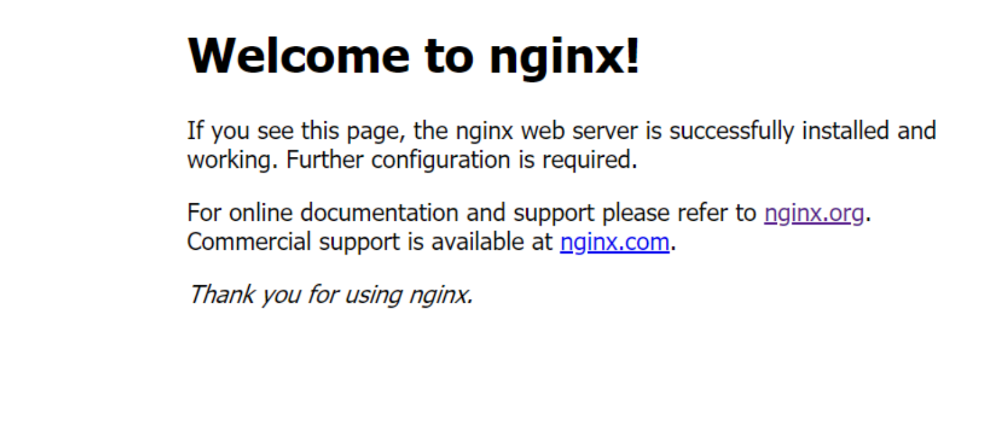

---

#### VeryNginx
- 首先克隆verynginx的仓库至虚拟机中，然后进入仓库目录，运行安装语句。

  ```bash
  # 安装一些库和依赖
  sudo apt-get install libpcre3-dev libssl1.0-dev zlib1g-dev build-essential
  # 克隆VeryNginx仓库
  git clone https://github.com/alexazhou/VeryNginx.git
  cd VeryNginx
  # 这里需要提权，以及注意python3
  sudo python3 install.py install
  # All work finished successfully, enjoy it~
  # 根据报错安装需要的依赖
  # 疑问：有一次在这句话后面加上了verynginx然后也显示了成功结束但没有安装上？
  ```
- 修改 `/opt/verynginx/openresty/nginx/conf/nginx.conf` 配置文件

  ```bash
  sudo vim /opt/verynginx/openresty/nginx/conf/nginx.conf
  # 将user从nginx修改为www-data
  # 修改server监听端口为8080
  # 保存退出
  ```
- 添加Nginx进程的权限
  ```bash
  chmod -R 777 /opt/verynginx/verynginx/configs
  ```
- 在主机访问8080端口发现可以访问Nginx初始页面。
    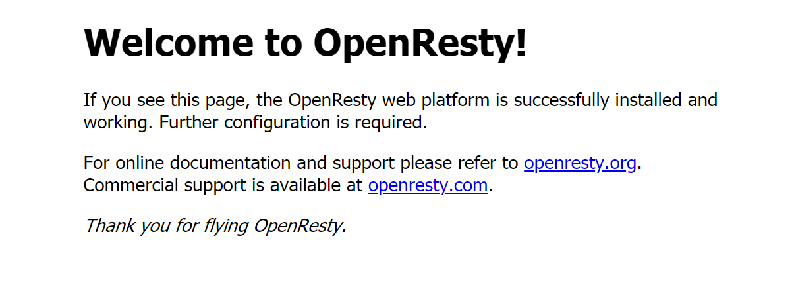
- 启动verynginx，通过浏览器对verynginx进行配置，在浏览器中访问`http://vn.sec.cuc.edu.cn:8080/verynginx/index.html` 默认用户名和密码是 `verynginx` / `verynginx`。登录后就可以进行相关配置。

    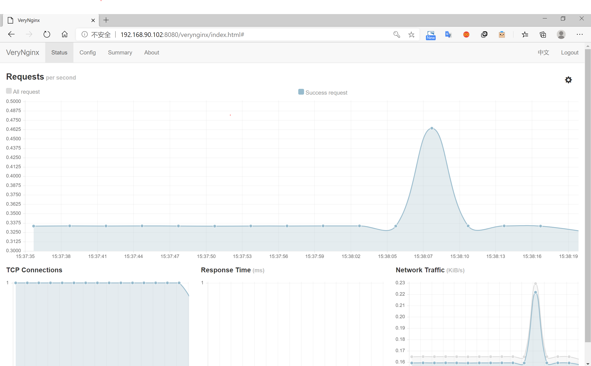


---

#### Wordpress

- 首先下载wordpress4.7安装包到 ubuntu18.04

  ```bash
  # 下载安装包
  sudo wget https://wordpress.org/wordpress-4.7.zip
  
  # 解压，unzip需要提前安装 
  unzip wordpress-4.7.zip
  
  # 将解压后的wordpress移到指定路径
  sudo mkdir /var/www/html/wp.sec.cuc.edu.cn
  sudo cp wordpress /var/www/html/wp.sec.cuc.edu.cn
  ```

- 在MySQL中新建一个数据库用于wordpress

  ```bash
  # 下载安装mysql数据库
  sudo apt install mysql-server
  # 登录
  sudo mysql
  ```
  ```sql
  # 新建一个数据库wordpress
  CREATE DATABASE wordpress DEFAULT CHARACTER SET utf8 COLLATE utf8_unicode_ci;
  
  # 新建一个用户 刷新并退出
  GRANT ALL ON wordpress.* TO 'wordpressuser'@'localhost' IDENTIFIED BY 'password';
  FLUSH PRIVILEGES;
  EXIT;
  ```

- 安装php扩展

  ```bash
  sudo apt update
  sudo apt install php-curl php-gd php-intl php-mbstring php-soap php-xml php-xmlrpc php-zip
  
  # 重启php-fpm
  sudo systemctl restart php7.2-fpm
  ```

- 配置nginx

  ```bash
  # 修改nginx配置 
  sudo vim /etc/nginx/sites-enabled/default
  
  # 将网站根站点修改为wordpress的安装目录 并保存退出
  root /var/www/html/wp.sec.cuc.edu.cn;
  ```

- 使用`wp.sec.cuc.edu.cn/wordpress/wp-admin/`访问wordpress进行配置，选择语言，然后连接数据库，设置完wordpress用户名密码即可访问wordpress网站。

  ```bash
  # 用户名  wordpressuser
  # 密码    password
  ```
  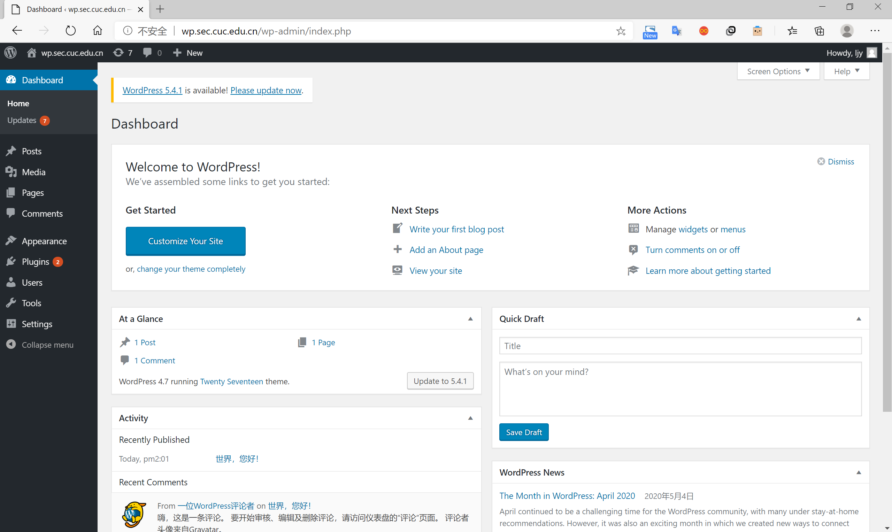

  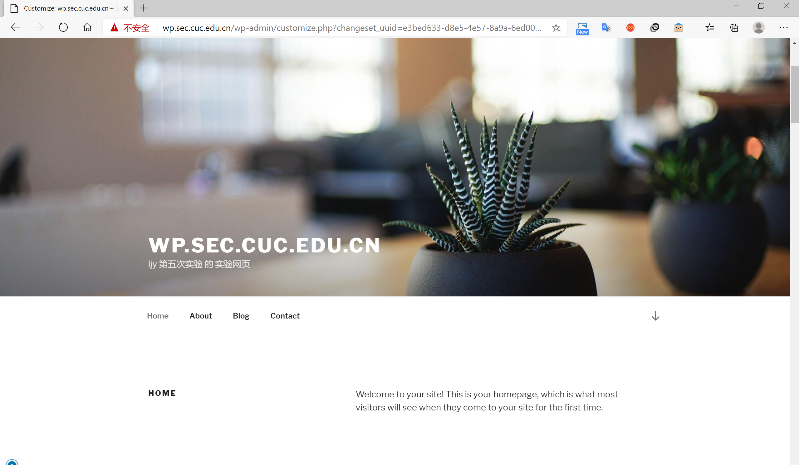


- 配置PHP-FPM进程的反向代理
  - 配置Nginx服务器块文件
   
    - 创建新服务器块配置文件
      ```bash
      sudo vim /etc/nginx/sites-available/wp.sec.cuc.edu.cn
      ```
    - 写入：
      ```bash
      server {
          listen 80 default_server;
          listen [::]:80 default_server;

          root /var/www/html/wp.sec.cuc.edu.cn;
          index index.php index.html index.htm index.nginx-debian.html;
          server_name wp.sec.cuc.edu.cn;

          location / {
              # try_files $uri $uri/ =404;
              try_files $uri $uri/ /index.php$is_args$args;
      
          }

          # 配置PHP-FPM进程的反向代理配置在nginx服务器上    
          location ~ \.php$ {
              include snippets/fastcgi-php.conf;
              fastcgi_pass unix:/var/run/php/php7.2-fpm.sock;
          }

          location ~ /\.ht {
              deny all;
          }
      }
      ```
      
  - 创建从新服务器块配置文件到/etc/nginx/sites-enabled/目录的符号链接
    ```bash
    sudo ln -s /etc/nginx/sites-available/wp.sec.cuc.edu.cn /etc/nginx/sites-enabled/
    ```
  - 取消链接默认配置文件
    ```bash
    sudo unlink /etc/nginx/sites-enabled/default
    ```
  - 测试并重启nginx
    ```bash
    sudo nginx -t
    sudo systemctl reload nginx
    ```
#### DVWA

- 下载安装
    ```bash
    #将DVWA源码clone到可写目录
    sudo git clone https://github.com/ethicalhack3r/DVWA /tmp/DVWA
    #拷贝至/var/www/html
    sudo mkdir /var/www/html/dvwa.sec.cuc.edu.cn
    sudo cp -r /tmp/DVWA/. /var/www/html/dvwa.sec.cuc.edu.cn
    ```

- 创建数据库和供DVWA使用的用户
    ```bash
    #登录MySQL
    sudo mysql

    #为dvwa创建MySQL数据库
    CREATE DATABASE dvwa DEFAULT CHARACTER SET utf8 COLLATE utf8_unicode_ci;
    GRANT ALL ON  dvwa.* TO 'dvwauser'@'localhost' IDENTIFIED BY 'p@ssw0rd';
    FLUSH PRIVILEGES;
    exit;
    ```
- 设置DVWA与PHP等相关环境
    ```bash
    # 重命名
    cd /var/www/html/dvwa.sec.cuc.edu.cn/config/
    sudo cp config.inc.php.dist config.inc.php

    # 修改配置
    sudo vim /var/www/html/DVWA/config/config.inc.php
    ## 根据数据库对应修改配置
    $_DVWA[ 'db_database' ] = 'dvwa';
    $_DVWA[ 'db_user' ]     = 'dvwauser';
    $_DVWA[ 'db_password' ] = 'p@ssw0rd';
    ##

    # 修改php配置
    sudo vim /etc/php/7.2/fpm/php.ini 
    
    ## 设置以下内容
    allow_url_include = on
    allow_url_fopen = on
    safe_mode = off
    magic_quotes_gpc = off
    display_errors = off
    ##

    #重启php
    sudo systemctl restart php7.2-fpm
    #将所有权分配给www-data用户和组
    sudo chown -R www-data.www-data /var/www/html/dvwa.sec.cuc.edu.cn
    ```
 
- 创建新服务器块配置文件
    ```bash
    sudo vim /etc/nginx/sites-available/dvwa.sec.cuc.edu.cn
    ```
- 写入：
    ```bash
    server {
        listen 8080 default_server;
        listen [::]:8080 default_server;

        root /var/www/html/dvwa.sec.cuc.edu.cn;
        index index.php index.html index.htm index.nginx-debian.html;
        server_name dvwa.sec.cuc.edu.cn;

        location / {
            #try_files $uri $uri/ =404;
            try_files $uri $uri/ /index.php$is_args$args;  
        }
  
        location ~ \.php$ {
            include snippets/fastcgi-php.conf;
            fastcgi_pass unix:/var/run/php/php7.2-fpm.sock;
        }

        location ~ /\.ht {
            deny all;
        }
    }
    ```
    
- 创建从新服务器块配置文件到/etc/nginx/sites-enabled/目录的符号链接
    ```bash
    sudo ln -s /etc/nginx/sites-available/dvwa.sec.cuc.edu.cn /etc/nginx/sites-enabled/
    ```

- 测试并重启Nginx服务
    ```bash
    sudo nginx -t
    sudo systemctl reload nginx
    ```


- 通过8080端口访问`dvwa.sec.cuc.edu.cn`，生成需要使用的数据库

    在登录页面输入默认账号密码：
    ```
    User: admin
    Password: password
    ```
    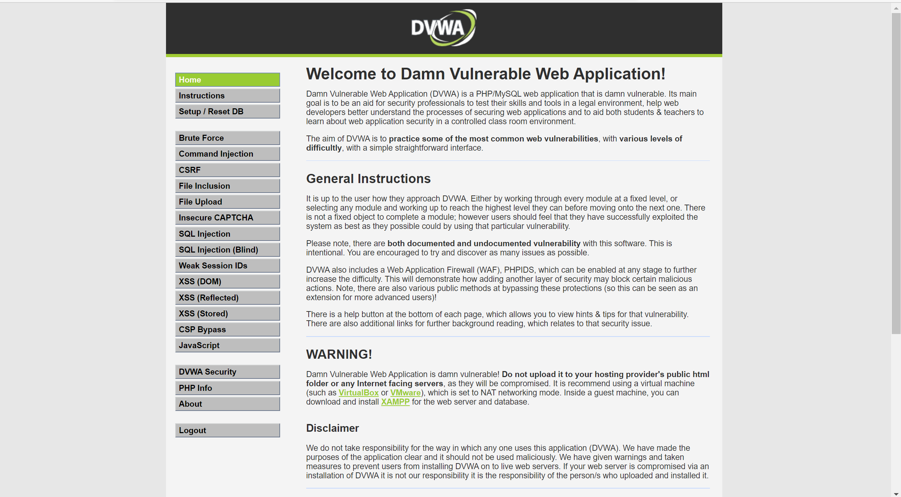
    
## 实验要求
### 基本要求

  - 在一台主机（虚拟机）上同时配Nginx和VeryNginx

    - VeryNginx作为本次实验的Web App的反向代理服务器和WAF
    - PHP-FPM进程的反向代理配置在nginx服务器上，VeryNginx服务器不直接配置Web站点服务

  - 使用[Wordpress](https://wordpress.org/)搭建的站点对外提供访问的地址为：  http://wp.sec.cuc.edu.cn，使用[Damn Vulnerable Web Application (DVWA)](http://www.dvwa.co.uk/)搭建的站点对外提供访问的地址为： http://dvwa.sec.cuc.edu.cn。
- 在前文配置基础上实现 
  - 这里老师说不要求配置成https，因此我们不进行ssl的配置.
  - 配置`wp.sec.cuc.edu.cn`和`dvwa.sec.cuc.edu.cn`
    - 添加matcher
      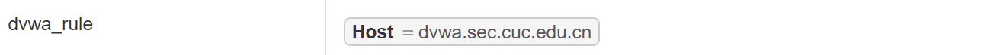
      
    - 添加Up Stream节点以及添加代理通行证
      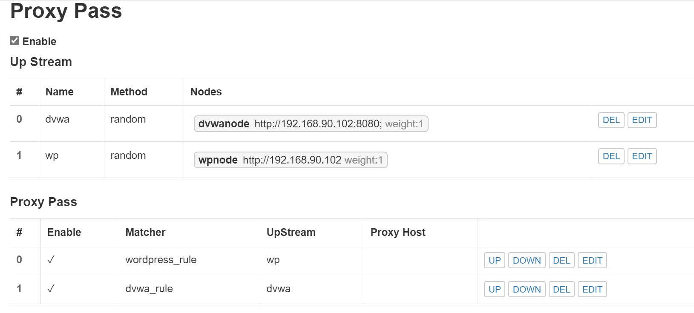

### 安全加固要求

- 1.使用IP地址方式均无法访问上述任意站点，并向访客展示自定义的**友好错误提示信息页面-1**

  - 添加matcher

    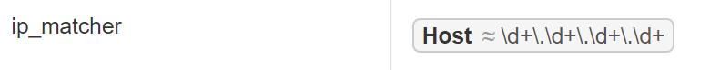

  - 添加自定义response

    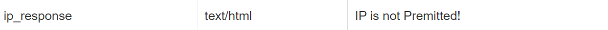

  - 添加filter

    

  - 结果:
 
    

- 2.[Damn Vulnerable Web Application (DVWA)](http://www.dvwa.co.uk/)只允许白名单上的访客来源IP，其他来源的IP访问均向访客展示自定义的**友好错误提示信息页面-2**

  - 添加matcher

    

  - 添加自定义response

    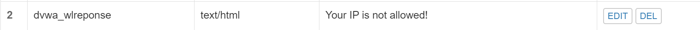

  - 添加filter

    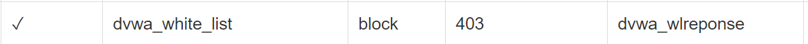

  - 结果: 禁掉自己IP后，之前正常显示的页面变为下图
 
    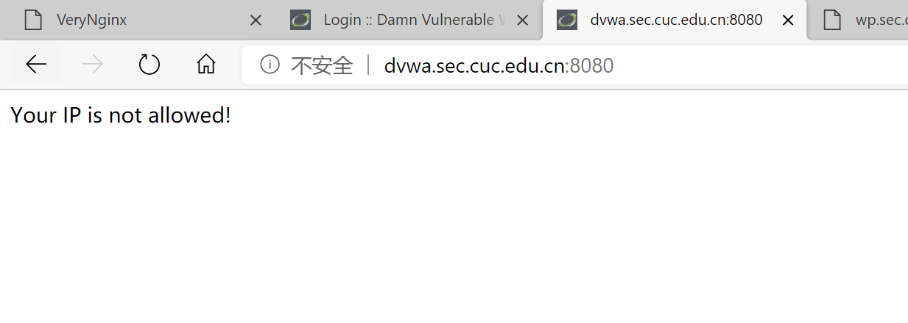

- 3.在不升级Wordpress版本的情况下，通过定制[VeryNginx](https://github.com/alexazhou/VeryNginx)的访问控制策略规则，热修复WordPress < 4.7.1 - Username Enumeration

  - 先还原bug
    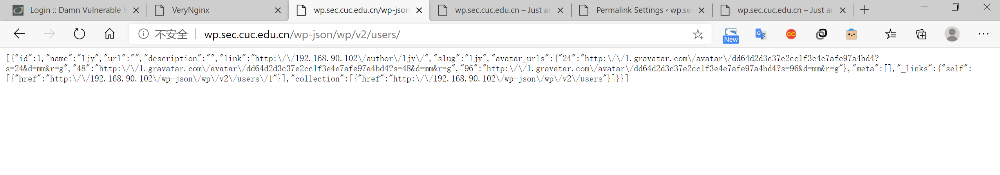

  - 添加matcher

    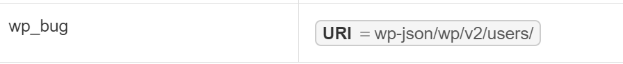

  - 添加filter

    

  - 结果
    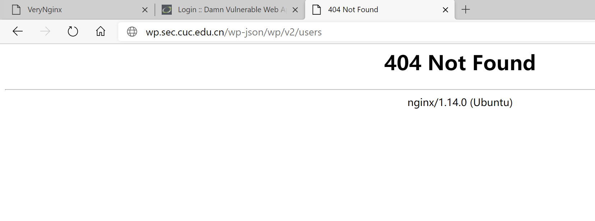
    

- 4.通过配置[VeryNginx](https://github.com/alexazhou/VeryNginx)的Filter规则实现对[Damn Vulnerable Web Application (DVWA)](http://www.dvwa.co.uk/)的SQL注入实验在低安全等级条件下进行防护

  

  - 添加matcher

    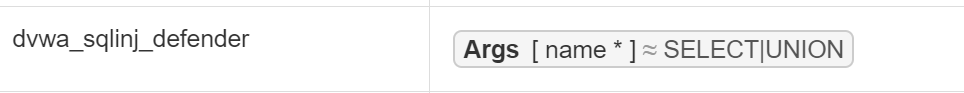


  - 添加filter

    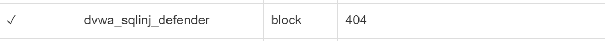

  - 因为没有要求自定义提示信息界面，我们直接返回404。结果

    


- 5.[VeryNginx](https://github.com/alexazhou/VeryNginx)的Web管理页面仅允许白名单上的访客来源IP，其他来源的IP访问均向访客展示自定义的**友好错误提示信息页面-3**
  - 添加matcher

    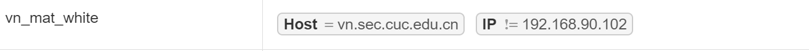

  - 添加自定义response

    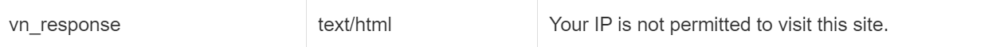

  - 添加filter

    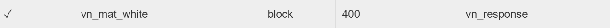

  - 结果:
 
    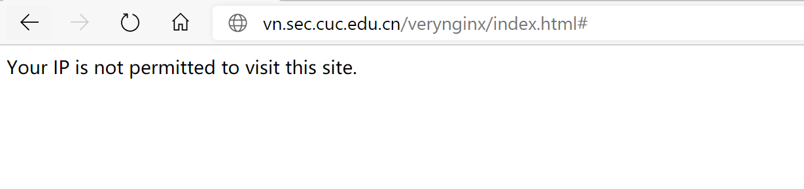


- 6.通过定制VeryNginx的访问控制策略规则实现：

  - 限制DVWA站点的单IP访问速率为每秒请求数 < 50
  - 限制Wordpress站点的单IP访问速率为每秒请求数 < 20
  - 超过访问频率限制的请求直接返回自定义**错误提示信息页面-4**

    - 添加自定义response

      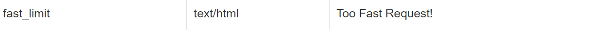

    - 添加频率限制Frequency Limit

      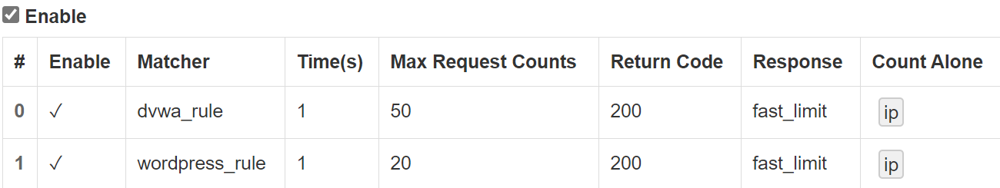

    - 结果 
      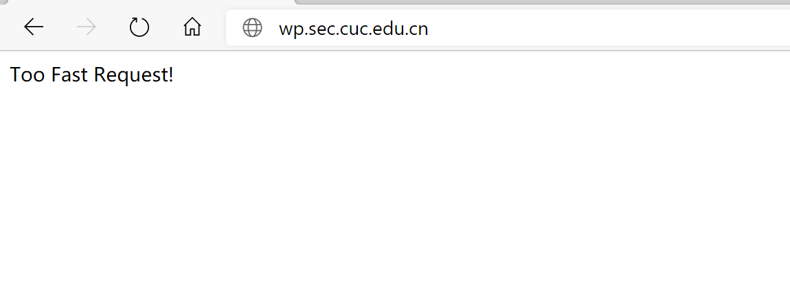
      
  - 禁止curl访问
  
    - 添加matcher
  
      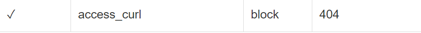
  
    - 添加filter
      

    - 结果
      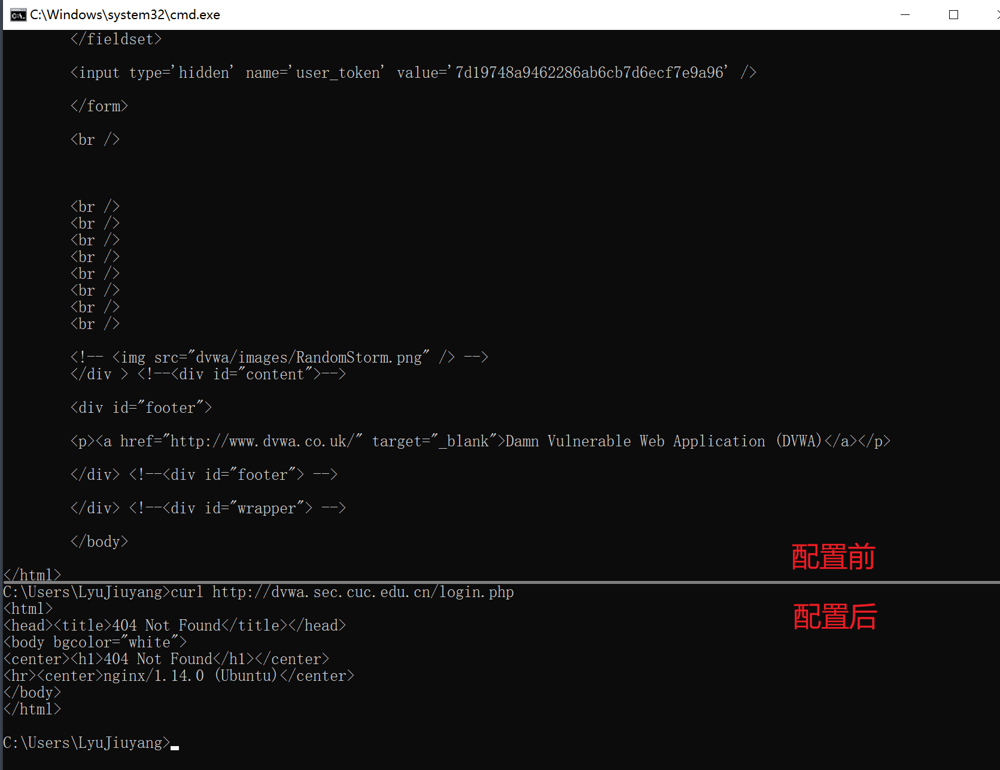 


​ 
## 参考链接
- [alexazhou/VeryNginx官方文档](https://github.com/alexazhou/VeryNginx/blob/master/readme_zh.md)
- [How To Install Linux, Nginx, MySQL, PHP (LEMP stack) on Ubuntu 18.04](https://www.digitalocean.com/community/tutorials/how-to-install-linux-nginx-mysql-php-lemp-stack-ubuntu-18-04)
- [How To Install WordPress with LEMP on Ubuntu 18.04](https://www.digitalocean.com/community/tutorials/how-to-install-wordpress-with-lemp-on-ubuntu-18-04)
- [How to Install and Configure DVWA Lab on Ubuntu 18.04 server](https://kifarunix.com/how-to-setup-damn-vulnerable-web-app-lab-on-ubuntu-18-04-server/)

## 实验过程遇到的问题

- wordpress一直无法安装，个人分析是之前上课安装的apache2占据了80端口，而且kill不掉卸载不干净（流氓包？）。因此新开了一个虚拟机重新配置。（此处省略两天时间各种安装wp失败）
- 把自己锁外面了。。。。。。以后可以先备份再封自己？