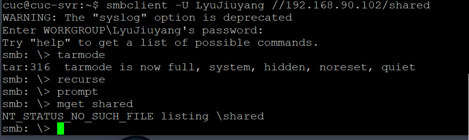

# Shell脚本编程进阶实验
FTP、NFS、DHCP、DNS、Samba服务器的自动安装与自动配置

## 实验环境


  - 工作主机(Ubuntu-18.04.4-Server 64bit)：192.168.90.102
  - 目标主机(Ubuntu-18.04.4-Server 64bit)：192.168.90.104

## 实验要求

   * FTP
     * 对照 [第6章课件](https://c4pr1c3.github.io/LinuxSysAdmin/chap0x06.md.html#/1) 中的要求选择一款合适的FTP服务器软件支持所有任务要求
   * NFS
     * 对照第6章课件中的NFS服务器配置任务
   * DHCP
     * 2台虚拟机使用Internal网络模式连接，其中一台虚拟机上配置DHCP服务，另一台服务器作为DHCP客户端，从该DHCP服务器获取网络地址配置
   * Samba
     * 对照第6章课件中smbclient一节的3点任务要求完成Samba服务器配置和客户端配置连接测试
   * DNS
     * 基于上述Internal网络模式连接的虚拟机实验环境，在DHCP服务器上配置DNS服务，使得另一台作为DNS客户端的主机可以通过该DNS服务器进行DNS查询
    在DNS服务器上添加`zone "cuc.edu.cn"` 的以下解析记录

           ns.cuc.edu.cn NS
           ns A <自行填写DNS服务器的IP地址>
           wp.sec.cuc.edu.cn A <自行填写第5章实验中配置的WEB服务器的IP地址>
           dvwa.sec.cuc.edu.cn CNAME wp.sec.cuc.edu.cn

## 完成情况
  - [x] FTP自动安装、自动配置
  - [x] NFS自动安装、自动配置
  - [x] DHCP自动安装、自动配置
  - [x] DNS手动安装、手动配置
  - [x] Samba手动安装、手动配置

## 实验步骤

### 1. 配置工作主机到目标主机的远程SSH免密登录
```bash
#在工作主机 上生成秘钥对
ssh-keygen -t rsa -P '' -f ~/.ssh/id_rsa

#修改目标主机配置文件，允许root用户远程登录
sudo vim /etc/ssh/sshd_config

    #设置可通过口令认证SSH
    PasswordAuthentication yes
    #允许root用户登录
    PermitRootLogin yes

#重启ssh服务
sudo systemctl restart ssh

#将公钥传输至目标主机authorized_keys文件
ssh-copy-id -i ~/.ssh/id_rsa root@192.168.90.104

#测试连接，输入密码登录
ssh root@192.168.90.104

#修改目标主机配置文件
sudo vim /etc/ssh/sshd_config

    PasswordAuthentication no
    PermitRootLogin without-password

sudo systemctl restart ssh

#免密登录
ssh -i ~/.ssh/id_rsa root@192.168.90.104
```


### 2. FTP
- 配置文件及脚本
  
  [vsftpd.sh](bash/vsftpd.sh) [vsftpd.conf](config/vsftpd.conf)

- **配置一个提供匿名访问的FTP服务器，匿名访问者可以访问1个目录且仅拥有该目录及其所有子目录的只读访问权限**

  

- **配置一个支持用户名和密码方式访问的账号，该账号继承匿名访问者所有权限，且拥有对另1个独立目录及其子目录完整读写（包括创建目录、修改文件、删除文件等）权限，（该账号仅可用于FTP服务访问，不能用于系统shell登录）**

  

- **FTP用户不能越权访问指定目录之外的任意其他目录和文件**

  无论是匿名用户还是非匿名用户都不能访问其他目录文件
  
  

- **匿名访问权限仅限白名单IP来源用户访问，禁止白名单IP以外的访问**

  

  
### 3. NFS
  - 脚本：[nfs_client.sh](bash/nfs_client.sh) [nfs_server.sh](bash/nfs_server.sh)   \
    配置文件：
    [/etc/exports](config/exports)
  - **在目标主机运行 `nfs_server.sh`**
    
  - **在工作主机运行 `nfs_client.sh`**
    
  - **在1台Linux上配置NFS服务，另1台电脑上配置NFS客户端挂载2个权限不同的共享目录，分别对应只读访问和读写访问权限;**
    
    
    
  - **共享目录中文件、子目录的属主、权限信息**
    

  - **添加两个/home下的共享目录，分别设置no_root_squash和不设置no_root_squash**
    - no_root_squash 
    - 未设置no_root_squash，无法写入或创建目录 
    - 查资料得知，
      设置共享文件夹属性时，如果设置 `no_root_squash` ，则属主和权限信息都继承父文件夹，否则，属主为 `root:root`

### 4. DHCP
- 脚本：[dhcp.sh](bash/dhcp.sh) \
  配置文件：[/dhcp/dhcpd.conf](config/dhcpd.conf) [/etc/default/isc-dhcp-server](config/isc-dhcp-server)

- **2台虚拟机使用Internal网络模式连接，其中一台虚拟机上配置DHCP服务，另一台服务器作为DHCP客户端，从该DHCP服务器获取网络地址配置**
  - 增加网卡为内部网络连接
    
  - 在目标主机上运行脚本 `dhcp.sh`，`sudo netplan apply`
    
  - 在工作主机netplan配置问价中添加enp0s9，`sudo netplan apply`。这时可以`ifconfig`查看到新增加的网卡。
    

### 5. Samba
- 配置文件：
- 在linux端执行如下操作
  ```bash
  ## 安装Samba服务器
  sudo apt-get install samba
  ## 创建Samba共享专用的用户 
  sudo useradd -M -s /sbin/nologin smbuser
  sudo passwd smbuser
  sudo smbpasswd -a smbuser
  ```

- **在/etc/samba/smb.conf 文件尾部追加以下“共享目录”配置，guest为匿名用户可以访问的目录（不可写），demo为虚拟用户才能访问的目录（可读写）**

    ```bash
    [guest]
    path = /home/samba/guest/
    read only = yes
    guest ok = yes

    [demo]
    path = /home/samba/demo/
    read only = no
    guest ok = no
    force create mode = 0660
    force directory mode = 2770
    force user = smbuser
    force group = smbgroup
    ```
- 之后执行
    ```bash
    # 恢复一个samba用户
    sudo smbpasswd -e smbuser

    
    # 创建用户组
    sudo groupadd smbgroup
    sudo usermod -G smbgroup smbuser

    # 创建用于共享的文件夹并修改用户组
    mkdir -p /home/samba/guest/
    mkdir -p /home/samba/demo/
    sudo chgrp -R smbgroup /home/samba/guest/
    sudo chgrp -R smbgroup /home/samba/demo/
    sudo chmod 2775 /home/samba/guest/
    sudo chmod 2770 /home/samba/demo/

    # 启动samba
    sudo smbd
    ```
- 在Windows上添加网络地址，访问两个文件夹（可读写/不可写），可以看出对于不可写文件夹demo需要密码登录，即基本功能设置成功。

    
    
    
    


#### Server：Windows & Client：Linux

- Windows设置共享目录

    - 参考：[linux-public-JuliBeacon](https://github.com/CUCCS/2015-linux-public-JuliBeacon/blob/exp6/%E5%AE%9E%E9%AA%8C%206/%E5%9C%A8Linux%E5%92%8CWindows%E9%97%B4%E8%AE%BE%E7%BD%AE%E6%96%87%E4%BB%B6%E5%85%B1%E4%BA%AB.md)
    
    
- 在虚拟机上执行
    ```bash
    # 下载安装smbclient
    sudo apt-get install smbclient

    # 查看所有共享目录
    sudo smbclient -L 192.168.90.102 -U LyuJiuyang
    ```
    
- 下载整个目录
  


### 6. DNS
- 配置文件: [/etc/bind/named.conf.options](configs/named.conf.options)  [/etc/bind/named.conf.local](configs/named.conf.local)  [/etc/bind/db.cuc.edu.cn](configs/db.cuc.edu.cn)

- **基于上述Internal网络模式连接的虚拟机实验环境，在DHCP服务器上配置DNS服务，使得另一台作为DNS客户端的主机可以通过该DNS服务器进行DNS查询 \
  在DNS服务器上添加 zone "cuc.edu.cn" 的解析记录**

- 在目标主机上
  
  * 安装bind9
  
    ```sudo apt update && sudo apt install bind9```
  * 修改配置文件`/etc/bind/named.conf.options`
    ```bash   
    # 添加
    listen-on { 192.168.57.1; };
    allow-transfer { none; };
    forwarders {
        8.8.8.8;
        8.8.4.4;
    };
    ```
  * 编辑配置文件`/etc/bind/named.conf.local`
    ```bash
    #添加如下配置
    zone "cuc.edu.cn" {
        type master;
        file "/etc/bind/db.cuc.edu.cn";
    };
    ```
  * 生成配置文件`db.cuc.edu.cn`

        $ sudo cp /etc/bind/db.local /etc/bind/db.cuc.edu.cn
  * 编辑配置文件`sudo vim /etc/bind/db.cuc.edu.cn`

    
  * 重启bind9：`sudo service bind9 restart`

## 参考资料
- [linux-2019-luyj/Linux_exp0x06.md](https://github.com/CUCCS/linux-2019-luyj/blob/Linux_exp0x06/Linux_exp0x06/Linux_exp0x06.md)
- [How To Set Up an NFS Mount on Ubuntu 18.04](https://www.digitalocean.com/community/tutorials/how-to-set-up-an-nfs-mount-on-ubuntu-18-04)
- [isc-dhcp-server](https://help.ubuntu.com/community/isc-dhcp-server)
- [在Linux和Windows间设置文件共享](https://github.com/CUCCS/2015-linux-public-JuliBeacon/blob/exp6/%E5%AE%9E%E9%AA%8C%206/%E5%9C%A8Linux%E5%92%8CWindows%E9%97%B4%E8%AE%BE%E7%BD%AE%E6%96%87%E4%BB%B6%E5%85%B1%E4%BA%AB.md)