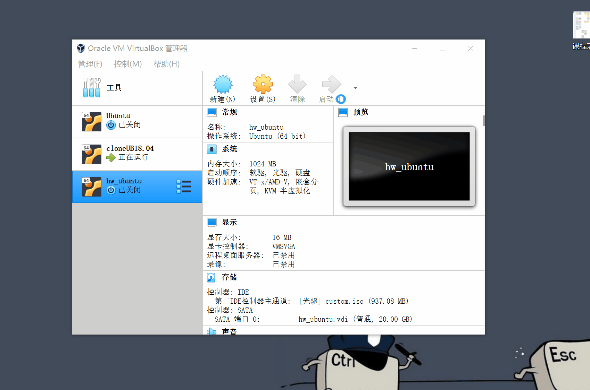

# 第一章：Linux基础-实验

## 软件环境

* Virtualbox
* Ubuntu 18.04.4 Server 64bit
* PuTTY 64bit

## 实验问题


* 如何配置无人值守安装iso并在Virtualbox中完成自动化安装。
* Virtualbox安装完Ubuntu之后新添加的网卡如何实现系统开机自动启用和自动获取IP？
* 如何使用sftp在虚拟机和宿主机之间传输文件？


## 无人值守安装iso制作

### 实现特性

* 定制一个普通用户名和默认密码
* 定制安装OpenSSH Server
* 安装过程禁止自动联网更新软件包

### 具体过程

#### 网络配置
开启两块网卡 `NAT` 和 `Host-Only` ，使用 `netplan` 配置。

- 修改配置文件并应用
```
sudo vim /etc/netplan/01-netcfg.yaml
sudo netplan apply
```


- 查看当前网卡状态，并获取ip


---

#### ssh免密登录
- 在服务器上安装 openssh-server
    ```bash
    # 更新源
    sudo apt update
    # 安装 OpenSSH 服务器应用
    sudo apt install openssh-server
    ```

- 使用 puttygen 生成rsa密钥并将私钥保存到本地，公钥上传至虚拟机，配置putty并保存会话。就可以实现免密登录。

    ```bash
    mkdir .ssh
    cd .ssh
    # 此处省略公钥
    echo -n 'PUBLIC_KEY' > authorized keys
    ```


登录界面（此图为后续补充截图，请忽略登录时间）


---

#### 定制镜像
  
- 将iso文件传至虚拟机


- 挂载镜像

    ```bash
    # 在当前用户目录下创建一个用于挂载iso镜像文件的目录
    mkdir loopdir

    # 挂载iso镜像文件到该目录
    # 需要使用sudo，记得对应ubuntu版本修改
    sudo mount -o loop ubuntu-18.04.4-server-amd64.iso loopdir

    # 创建一个工作目录用于克隆光盘内容
    mkdir cd
    
    # 同步光盘内容到目标工作目录
    # 一定要注意loopdir后的这个/，cd后面不能有/
    rsync -av loopdir/ cd

    # 卸载iso镜像
    sudo umount loopdir

    # 进入目标工作目录
    cd cd/

    # 编辑Ubuntu安装引导界面增加一个新菜单项入口
    vim isolinux/txt.cfg
    ```


- 添加以下内容到该文件**首部**后强制保存退出 (:wq!)

    ```
    label autoinstall
    menu label ^Auto Install Ubuntu Server
    kernel /install/vmlinuz
    append  file=/cdrom/preseed/ubuntu-server-autoinstall.seed debian-installer/locale=en_US console-setup/layoutcode=us keyboard-configuration/layoutcode=us console-setup/ask_detect=false localechooser/translation/warn-light=true localechooser/translation/warn-severe=true initrd=/install/initrd.gz root=/dev/ram rw quiet
    ```


* 提前阅读并编辑定制Ubuntu官方提供的示例[preseed.cfg](https://help.ubuntu.com/lts/installation-guide/example-preseed.txt)，并将该文件保存到刚才创建的工作目录``~/cd/preseed/ubuntu-server-autoinstall.seed``
  
  使用psftp直接传至服务器失败，故先传至`/home/cuc`目录下再进行移动
  ```
  put D:\iso\ubuntu-server-autoinstall.seed
  ```
  ```
  sudo mv ubuntu-server-autoinstall.seed /home/cuc/cd/preseed/
  ```
* 修改isolinux/isolinux.cfg，增加内容 ``timeout 10``（可选，否则需要手动按下ENTER启动安装界面）


- 在服务器上安装 `mkisofs` 后进行后续操作。
  
    ```bash
    # 这里全部使用绝对路径
    # 重新生成md5sum.txt
    cd /home/cuc/cd && find . -type f -print0 | xargs -0 md5sum > md5sum.txt

    # 封闭改动后的目录到.iso
    IMAGE=custom.iso
    BUILD=/home/cuc/cd

    mkisofs -r -V "Custom Ubuntu Install CD" \
                -cache-inodes \
                -J -l -b isolinux/isolinux.bin \
                -c isolinux/boot.cat -no-emul-boot \
                -boot-load-size 4 -boot-info-table \
                -o $IMAGE $BUILD

    ```


---

#### 实验结果

使用psftp将镜像拷贝到本地，并在虚拟机上安装
```bash
# 指定本地目录
lcd D:\iso

get custom.iso
```
自动安装过程约四分钟，这里加速缩短至6s



输入定制的用户名和密码，成功登录。


#### 文件比对


使用 [mergely](http://mergely.com/editor) 进行文件比对。

综合注释，可看出自上至下的老师做出的修改作用依次为：
- 从Debian的版本名称 `stretch` 修改为Ubuntu 16.04的名称 `xenial`
- 更改至中文字符集
- 跳过语言安装界面，上面注释给出了问答界面网址
- 选择特定的接口，但这两行被注释了
- 将链路超时时间缩短为5
- 将DHCP超时时间缩短为5
- 手动配置网络
- 静态网络配置
- 更改主机名、域名
- 强制使用主机名
- 创建用户名、密码
- 更改时区为亚洲-上海
- 设置在安装时不使用NTP设置时钟
- 删除了i386特定磁盘存储相关的注释，资料显示i386为32位电脑架构，个人认为是与64位系统不相关故删除。
- 自动安装时选取空余空间
- LVM分区时，设置可用空间大小为最大
- 设置预定义的分区方案为 `multi`，即分离`/home` `/var` 和`/tmp`
- 禁止使用网络镜像
- 将选择安装的软件包由桌面版改为服务器版
- 安装openssh-server
- 禁止自动升级
- 更改系统软件升级策略为 自动更新

部分截图


## 实现系统开机自动启用网卡和自动获取IP

Ubuntu 18.04 Server修改了IP地址配置程序，删除了以前的`ifup/ifdown`命令和`/etc/network/interfaces`配置文件， 改为使用`/etc/netplan/01-netcfg.yaml`和`sudo netplay apply`命令管理IP地址.

具体步骤即上述的[网络配置](#%e7%bd%91%e7%bb%9c%e9%85%8d%e7%bd%ae)。


## 使用sftp在虚拟机和宿主机之间传输文件
当虚拟机开启了ssh后，宿主机可以使用psftp连接，使用`get` / `up`来传输文件，具体步骤[见上](#ssh%e5%85%8d%e5%af%86%e7%99%bb%e5%bd%95)。
## 过程中遇到的问题
- 多个操作不被允许。  
  使用sudo提权，代码进行了部分更改。
- Ubuntu 18.04 Server 不会粘贴操作，网上查得快捷键无效。  
  使用putty通过ssh连接再操作。
- 第一次按照课件代码，制作的iso文件无法运行。  
  把所有的目录改为绝对路径之后正常。分析可能是当前路径错误导致相对路径错误，命令没有有效执行。
## 参考资料

[课件及教学视频](https://space.bilibili.com/388851616/channel/detail?cid=103824)

[jckling师姐的实验报告](https://github.com/CUCCS/linux-2019-jckling/tree/master/0x01)

[PuTTy Tutorial](https://www.siteground.com/tutorials/ssh/putty/)

[netplan.io](https://netplan.io/examples)

[How to configure static IP address on Ubuntu 18.04 Bionic Beaver Linux](https://linuxconfig.org/how-to-configure-static-ip-address-on-ubuntu-18-04-bionic-beaver-linux)